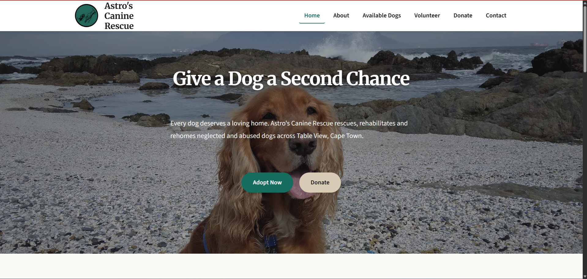
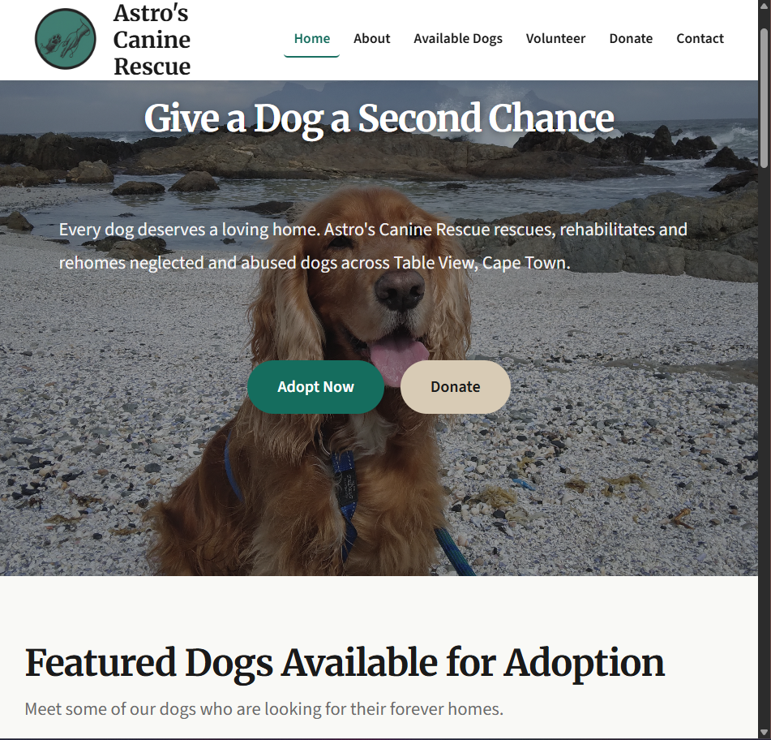
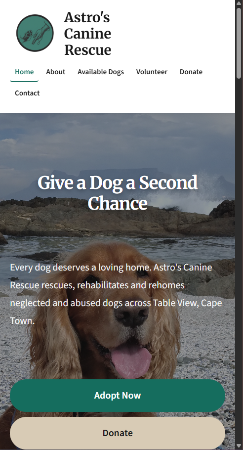

# Astro's Canine Rescue

## Student Information
| Field | Detail |
|---|---|
| Student Name | Brittany Marie Haupt |
| Student Number | ST10500773 |
| Module | Web Development (Introduction) — WEDE5020/p/w |
| Academic Year | 2026 |

---

## Project Overview
This repository contains the source code for the **Astro's Canine Rescue** website, developed as part of the WEDE5020 Portfolio of Evidence (PoE). Astro's Canine Rescue is a fictional non-profit organisation (NPO) based in Table View, South Africa, that rescues, rehabilitates, and rehomes abandoned and abused domestic animals. 

---

## Website Goals and Objectives
1. Establish a professional online presence for the NPO.
2. Enable prospective adopters to browse available animals and submit adoption enquiries.
3. Provide a clear pathway for volunteers and sponsors to engage with the organisation.
4. Promote community awareness of animal welfare issues in Cape Town.
5. Optimise for search engines to improve organic discoverability.

---

## Key Features and Functionality
| Feature | Status |
|---|---|
| 6 fully structured HTML pages | Part 1 |
| Semantic HTML5 layout (header, nav, main, footer) | Part 1 |
| Navigation linking all 6 pages | Part 1 |
| Enquiry form (volunteer / sponsor / adoption) | Part 1 (HTML structure) |
| Contact form with general messaging | Part 1 (HTML structure) |
| Two embedded shelter location maps | Part 1  |
| External CSS stylesheet | Part 2 |
| Responsive design (mobile & tablet) | Part 2 |
| External CSS stylesheet linked to all pages | Part 2 |
| CSS custom properties | Part 2 |
| Default / base styles and CSS reset | Part 2 |
| Typography styles  | Part 2 |
| Flexbox and CSS Grid layout structure | Part 2 |
| Colour scheme, decoration and box-shadow styles| Part 2 |
| Pseudo-class styles (:hover, :focus, :active, :checked, :invalid, :valid) | Part 2 |
| Sticky navigation bar| Part 2 |
| Responsive Design - tablet breakpoint (max-width: 900px)| Part 2 |
| Responsive Design - mobile breakpoint (max-width: 600px)| Part 2 |
| Responsive layout, typography, navigation and image adjustment| Part 2 |
| JavaScript form validation |  Part 3 |
| Lightbox image gallery |  Part 3 |
| Animal filter / search |  Part 3 |
| Leflet.js interactive map| Part 3 |
| Hamburger navigation toggle (JavaScript) | Part 3 |


---

## Timeline and Milestones
| Milestone | Target Date | Status |
|---|---|---|
| Part 1: HTML structure & project proposals | Week 2 |  Complete |
| Part 2: CSS styling & responsive design | Week 6 |  Completed |
| Part 3: JavaScript, forms & SEO | Week 10 |  Pending |
| Final review & testing | Week 11 |  Pending |
| PoE submission | Week 12 | Pending |

---

## Part 1 Details

### File and Folder Structure
```
astroswebsite/
├── index.html          # Homepage — hero, impact stats, featured animals
├── about.html          # About Us — history, mission, vision, team
├── services.html       # Adoptions — animal listings, adoption process, fees
├── enquiry.html        # Volunteer form
├── donate.html         # Donate — donation and wish list section
├── contact.html        # Contact — shelter details, maps, general message form
├── css/
│   └── style.css       # External stylesheet (styled in Part 2)
├── js/
│   └── script.js         # Main JavaScript file (implemented in Part 3)
└── images/
    ├── screenshots/
    |   ├── Desktop.png
    |   ├── phone.png 
    |   └──Tablet.png
    └── team/
    |    ├── jake-nackos-IF9TK5Uy-KI-unsplash.jpg
    |    ├── karsten-winegeart-bwDnRf-r4u8-unsplash.jpg
    |    ├── nartan-buyukyildiz-hr_feH2URs0-unsplash.jpg
    |    └── danny-postma-zNxOw2JFNKs-unsplash.jpg
    ├──  victor-g-x5oPmHmY3kQ-unsplash.jpg  #All the dog pictures and the logo
    ├──  alvan-nee-8g0D8ZfFXyA-unsplash.jpg
    ├──  ash-v0_MCllHY9M-unsplash.jpg
    ├── baptist-standaert-mx0DEnfYxic-unsplash.jpg
    ├── brooke-cagle-Ntm4C2lCWxQ-unsplash.jpg
    ├── cristofer-maximilian-5_nJw3UUgpQ-unsplash.jpg
    ├── isaac-benhesed-6TEBZsjQbEc-unsplash.jpg
    ├── karsten-winegeart-Qb7D1xw28Co-unsplash.jpg
    ├── kinshuk-bose-pkgznCMKDXo-unsplash.jpg
    ├── logo.png
    └── nathalie-ehrnleitner-SApQiu5GIdQ-unsplash.jpg
```

### Sitemap

The website uses a flat navigation structure where all six pages are accessible from every page via the shared navigation bar.

```
┌─────────────────────────────────────────────────────────────────┐
│              Shared Header / Navigation Bar                     │
└─────────────────────────────────────────────────────────────────┘
       │           │           │           │          │         │
  ┌────┴───┐  ┌────┴───┐   ┌───┴────┐  ┌───┴───┐   ┌──┴────┐  ┌─┴──────┐
  │  Home  │  │ About  │   │  Dogs  │  │ Enq.  │   │Donate │  │Contact │
  │index   │  │about   │   │services│  │enquiry│   │donate │  │contact │
  │.html   │  │.html   │   │.html   │  │.html  │   │.html  │  │.html   │
  └────┬───┘  └────┬───┘   └───┬────┘  └───┬───┘   └──┬────┘  └─┬──────┘
       │           │           │           │          │          │
  • Hero banner  • Mission   • Filter      • Why vol. • Impact   • Contact info
  • Dog cards    • Our story • Dog list.   • Require. • Donate   • Message form
  • Our mission  • The team  • Adopt steps • Apply    • EFT      • Leaflet map
  • Impact stats • Values    • FAQs        • Form     • Wish list • FAQs
  • Get involved • Partners                • Stories             • Emergency

┌─────────────────────────────────────────────────────────────────┐
│       Shared Footer — Quick Links · Contact · Social Media      │
└─────────────────────────────────────────────────────────────────┘
```
You can find a image of the sitemap inside the folder Sitemap in the Research and Content folder that was submitted.

---

## Part 2 Details

### CSS Architecture

The external stylesheet (`css/style.css`) is organised into 21 clearly commented sections:

| Section | Purpose |
|---|---|
| 1. CSS Custom Properties | Design tokens — colours, fonts, spacing, shadows, breakpoints |
| 2. CSS Reset / Normalisation | Removes browser default inconsistencies using box-sizing, margin, padding reset |
| 3. Typography | Heading hierarchy (h1–h4), body text, blockquotes, line-height, letter-spacing |
| 4. Layout Utilities | `.container`, `.two-col`, section spacing, `.section-subtext` |
| 5. Buttons | `.btn`, `.btn-primary`, `.btn-secondary`, `.btn-outline`, `.btn-danger` |
| 6. Header and Navigation | Sticky header, logo, navigation links, active page indicator, donate pill |
| 7. Hero Sections | Full-bleed homepage hero and inner-page coloured hero band |
| 8. Dog Cards and Grid | CSS Grid card layout, image hover zoom, favourite button |
| 9. Homepage Sections | Featured dogs, mission, stats, CTA |
| 10. About Page Sections | Mission/vision, story layout, team grid, values, impact, partners |
| 11. Services Page | Filter bar, pagination, adoption process steps |
| 12. FAQ Section | Accordion toggle styles (JS activation in Part 3) |
| 13. Enquiry Page | Why volunteer, requirements, how to apply, volunteer stories |
| 14. Donate Page | Impact tiers, donation form, EFT aside, wish list |
| 15. Contact Page | Contact sidebar, form wrapper, map container, emergency section |
| 16. Forms | Global fieldset, legend, input, textarea, select, checkbox and radio styles |
| 17. Footer | Three-column footer grid, social icons, footer bottom bar |
| 18. Pseudo-classes | :hover, :focus-visible, :active, :checked, :invalid, :valid, :disabled |
| 19. Responsive — Tablet | max-width: 900px — two-column grids, compact nav, reflow |
| 20. Responsive — Mobile | max-width: 600px — single-column, stacked nav, full-width buttons |
| 21. Print Styles | Hides nav/footer/buttons, shows link URLs |

### Design Tokens Used
| Token | Value | Usage |
|---|---|---|
| `--colour-primary` | `#046D5D` | Buttons, links, headings, accents |
| `--colour-accent` | `#D9CBB3` | CTA section background, secondary button |
| `--colour-bg` | `#F9F9F6` | Page background (warm ivory) |
| `--font-heading` | Merriweather, serif | All headings |
| `--font-body` | Source Sans 3, sans-serif | Body text and labels |

### Responsive Breakpoints
| Breakpoint | Width | Key Changes |
|---|---|---|
| Desktop | > 900px | Full layouts — 3-4 column grids |
| Tablet | ≤ 900px | 2-column grids, compact nav, stacked contact layout |
| Mobile | ≤ 600px | Single-column, stacked nav, full-width buttons, scaled typography |

### Mobile Navigation
The navigation bar compresses and adapts at the mobile breakpoint (max-width: 600px). 
A hamburger toggle menu will be implemented in Part 3 using JavaScript, as noted in the CSS comments.


### Screenshot Evidence: Responsive Design

**Desktop (1280px)**  



**Tablet (768px)**  


**Mobile (390px)**  


---

## Changelog

### [Part 2]: May 2026

#### Changes Based on Part 1 Feedback
- Part 1 received a mark of 100%. No corrections or changes were required based on feedback. Development proceeded directly to Part 2 CSS styling.

#### CSS Stylesheet Created
- Created `css/style.css` as the single external stylesheet linked to all six HTML pages.
- Defined CSS custom properties (design tokens) for brand colours, typography, spacing, shadows, transitions and border radius. This ensures consistent styling sitewide and makes future design changes simpler.
- Applied a full CSS reset (box-sizing, margin, padding, image normalisation) to remove browser inconsistencies.

#### Typography
- Set `font-family: 'Merriweather', Georgia, serif` for all heading elements (h1–h4) and `font-family: 'Source Sans 3', 'Segoe UI', Arial, sans-serif` for body text, as specified in the project proposal.
- Created a fluid type scale using `rem` units from `--fs-xs` (0.75rem) to `--fs-3xl` (3rem).
- Applied `line-height`, `letter-spacing`, and `font-weight` values to headings and body paragraphs for readability.

#### Layout Structure
- Used CSS Flexbox for the header, navigation, footer, and button groups.
- Used CSS Grid for all card grids (dog cards, team, values, impact, tiers, wish list, stories), the footer three-column layout, the contact two-panel layout, and process steps.
- Implemented a `.container` utility class with a max-width of 1200px and centred horizontal padding for consistent section widths.

#### Decoration and Colour
- Applied brand colour palette: emerald green (`#046D5D`), soft sand (`#D9CBB3`), warm ivory (`#F9F9F6`) across backgrounds, buttons and section bands.
- Used `box-shadow` values for card elevation (`.dog-card`, `.team-card`, `.value-card`, `.tier-card`, `.story-card`).
- Applied `border-radius` to create soft rounded edges on cards, buttons, form fields and images.
- Added image overlays using `opacity` on the homepage hero image to create a text-readable dark overlay effect.
- Added `border-top` accent lines to benefit cards and tier cards using the primary colour.
- Applied `background-color` alternation across page sections (ivory, alt-ivory, primary green, sand) to create visual rhythm.

#### Pseudo-classes Applied
- `:hover` — card lift effect (`transform: translateY`), button colour deepening, nav underline, link colour change, filter bar border highlight, dog image zoom, social icon background fill.
- `:focus-visible` — green outline with offset applied to all interactive elements (buttons, links, inputs, checkboxes, radio buttons) for keyboard and screen reader accessibility.
- `:active` — button `transform: translateY(0)` to cancel the hover lift, giving tactile click feedback.
- `:checked` — amount radio buttons styled as filled green pill labels when selected (using the hidden `<input>` + adjacent sibling `<label>` pattern).
- `:invalid` and `:valid` — red/green border feedback on form inputs after the user has interacted (`:not(:placeholder-shown)` guard prevents styling on empty untouched fields).
- `:disabled` — greyed-out background and `not-allowed` cursor on disabled form controls.
- `[aria-current="page"]` — green underline on the active navigation link.

#### Sticky Navigation
- Applied `position: sticky; top: 0; z-index: 100` to `.site-header` so the navigation bar remains fixed at the top of the viewport as the user scrolls.

#### Responsive Design: Tablet (max-width: 900px)
- Typography scaled down for h1–h3.
- Dog grid, team grid, values grid, tiers grid, stories grid reduced from 3-4 columns to 2 columns.
- Impact grid reduced to 2-column.
- Two-column sections (About mission/vision, Our Story) stacked to single column.
- Process steps reduced to 2-column, connector line hidden.
- Contact layout stacked to single column.
- Footer reduced to 2-column grid.
- Filter bar converted from horizontal flex row to full-width stacked column.
- FAQ two-column layout collapsed to single column.
- Volunteer requirements list collapsed to single column.

#### Responsive Design: Mobile (max-width: 600px)
- All multi-column grids collapsed to single column (dog grid, values, benefits, tiers, stories, partners, stats, process steps).
- Team grid retained as 2-column (compact portrait cards).
- Impact grid retained as 2-column.
- Amount grid retained as 2-column (pill buttons).
- Header stacked vertically; nav links wrap at smallest font size.
- Hero actions and CTA actions stacked full-width.
- All buttons set to `width: 100%; justify-content: center`.
- Form rows stacked to single column.
- Checkbox grids collapsed to single column.
- Section padding reduced via CSS custom property override.


### [Part 1] - April 2026

#### Initial Commit
- Created public GitHub repository and initialised with README.md.

#### HTML Structure
- Created `index.html`: homepage with hero section, impact stats, featured animal cards, our mission section and volunteer section.
- Created `about.html`: organisation history section, mission, meet our team section and our partner section.
- Created `services.html`: (Available Dogs) search and filter feature, all 9 dogs listed with details, adoption process and adoption FAQ.
- Created `enquiry.html`: Why volunteer with us, volunteer requirements, how to apply, volunteer stories section and then a volunteer application form.
- Created `contact.html`: Get in touch section with all relevant details, plan to implement a map, send us a message section, FAQ section and emergency section.
- Created `donate.html` : Show impact a donation would make section, make a donation section and then a wish list section

#### CSS Placeholder
- Created `css/style.css` for part 2

#### JavaScript Placeholder
- Created `js/main.js` for part 3

#### Assets
- Created `images/` directory with sub-folder for volunteers and team. All dog pictures are in the main images folder.

---

## References

Afrihost, 2024. *Domain registration pricing*. [Online] Available at: <https://www.afrihost.com/domains> [Accessed 15 March 2025].

Animal Welfare Society of South Africa, 2024. *AWSSA official website*. [Online] Available at: <https://www.awssa.org.za> [Accessed 20 March 2025].

Benhesed, I., 2026. *Rescue shelter founding image*. [Online] Unsplash. Available at: <https://unsplash.com/> [Accessed 18 April 2026].

Bose, K., 2026. *German Shepherd dog portrait*. [Online] Unsplash. Available at: <https://unsplash.com/> [Accessed 18 April 2026].

Buyukyildiz, N., 2026. *Vet liaison portrait*. [Online] Unsplash. Available at: <https://unsplash.com/> [Accessed 18 April 2026].

Cagle, B., 2026. *Goldendoodle dog portrait*. [Online] Unsplash. Available at: <https://unsplash.com/> [Accessed 18 April 2026].

Cape Town SPCA, 2024. *Cape Town SPCA official website*. [Online] Available at: <https://www.spca-ct.co.za> [Accessed 20 March 2025].

CSS-Tricks, 2024. *A complete guide to CSS Grid*. [Online] Available at: <https://css-tricks.com/snippets/css/complete-guide-grid/> [Accessed 1 May 2026].

CSS-Tricks, 2024. *A complete guide to Flexbox*. [Online] Available at: <https://css-tricks.com/snippets/css/a-guide-to-flexbox/> [Accessed 1 May 2026].

Ehrnleitner, N., 2026. *Appenzeller Sennenhund dog portrait*. [Online] Unsplash. Available at: <https://unsplash.com/> [Accessed 18 April 2026].

Font Awesome, 2026. *Font Awesome Free Icons*. [Online] Available at: <https://fontawesome.com/> [Accessed 18 April 2026].

GitHub, 2024. *GitHub Pages documentation*. [Online] Available at: <https://docs.github.com/en/pages> [Accessed 15 March 2025].

Google Fonts, 2026. *Merriweather and Source Sans 3*. [Online] Available at: <https://fonts.google.com/> [Accessed 18 April 2026].

Lakota, T., 2026. *Male volunteer portrait (David)*. [Online] Unsplash. Available at: <https://unsplash.com/> [Accessed 18 April 2026].

Leaflet.js, 2026. *Leaflet interactive maps*. [Online] Available at: <https://leafletjs.com/> [Accessed 18 April 2026].

Maura, T., 2026. *Female volunteer portrait (Amy)*. [Online] Unsplash. Available at: <https://unsplash.com/> [Accessed 18 April 2026].

Maximilian, C., 2026. *Weimaraner dog portrait*. [Online] Unsplash. Available at: <https://unsplash.com/> [Accessed 18 April 2026].

McDermott, J., 2026. *Events volunteer portrait (Zanele)*. [Online] Unsplash. Available at: <https://unsplash.com/> [Accessed 18 April 2026].

MDN Web Docs, 2024. *CSS custom properties (variables)*. [Online] Available at: <https://developer.mozilla.org/en-US/docs/Web/CSS/Using_CSS_custom_properties> [Accessed 1 May 2026].

MDN Web Docs, 2024. *CSS Grid Layout*. [Online] Available at: <https://developer.mozilla.org/en-US/docs/Web/CSS/CSS_Grid_Layout> [Accessed 1 May 2026].

MDN Web Docs, 2024. *CSS Flexbox*. [Online] Available at: <https://developer.mozilla.org/en-US/docs/Learn/CSS/CSS_layout/Flexbox> [Accessed 1 May 2026].

MDN Web Docs, 2024. *Responsive design*. [Online] Available at: <https://developer.mozilla.org/en-US/docs/Learn/CSS/CSS_layout/Responsive_Design> [Accessed 1 May 2026].

MDN Web Docs, 2024. *Using media queries*. [Online] Available at: <https://developer.mozilla.org/en-US/docs/Web/CSS/CSS_media_queries/Using_media_queries> [Accessed 1 May 2026].

MDN Web Docs, 2024. *HTML forms guide*. [Online] Available at: <https://developer.mozilla.org/en-US/docs/Learn/Forms> [Accessed 15 March 2025].

Nackos, J., 2026. *Volunteer coordinator portrait*. [Online] Unsplash. Available at: <https://unsplash.com/> [Accessed 18 April 2026].

Nee, A., 2026. *Scottish Terrier X Yorkie dog portrait*. [Online] Unsplash. Available at: <https://unsplash.com/> [Accessed 18 April 2026].

Postma, D., 2026. *Shelter manager portrait*. [Online] Unsplash. Available at: <https://unsplash.com/> [Accessed 18 April 2026].

Republic of South Africa, 1997. *Non-Profit Organisations Act 71 of 1997*. Pretoria: Government Printer.

Standaert, B., 2026. *Border Collie dog portrait*. [Online] Unsplash. Available at: <https://unsplash.com/> [Accessed 18 April 2026].

TEARS Animal Rescue, 2024. *TEARS official website*. [Online] Available at: <https://www.tears.org.za> [Accessed 20 March 2025].

Unsplash contributor, 2026. *Golden Retriever dog portrait*. [Online] Unsplash. Available at: <https://unsplash.com/> [Accessed 18 April 2026].

Unsplash contributor, 2026. *Husky dog portrait*. [Online] Unsplash. Available at: <https://unsplash.com/> [Accessed 18 April 2026].

Unsplash contributor, 2026. *Rescued dog looking hopefully at the camera*. [Online] Unsplash. Available at: <https://unsplash.com/> [Accessed 18 April 2026].

W3C, 2023. *Web Content Accessibility Guidelines (WCAG) 2.1*. [Online] Available at: <https://www.w3.org/TR/WCAG21> [Accessed 15 March 2025].

W3Schools, 2024. *CSS :hover selector*. [Online] Available at: <https://www.w3schools.com/cssref/sel_hover.php> [Accessed 1 May 2026].

W3Schools, 2024. *CSS media queries*. [Online] Available at: <https://www.w3schools.com/css/css_rwd_mediaqueries.asp> [Accessed 1 May 2026].

W3Schools, 2024. *HTML semantic elements*. [Online] Available at: <https://www.w3schools.com/html/html5_semantic_elements.asp> [Accessed 15 March 2025].

Winegeart, K., 2026. *Shih Tzu dog portrait*. [Online] Unsplash. Available at: <https://unsplash.com/> [Accessed 18 April 2026].

Winegeart, K., 2026. *Founder team at shelter*. [Online] Unsplash. Available at: <https://unsplash.com/> [Accessed 18 April 2026].
